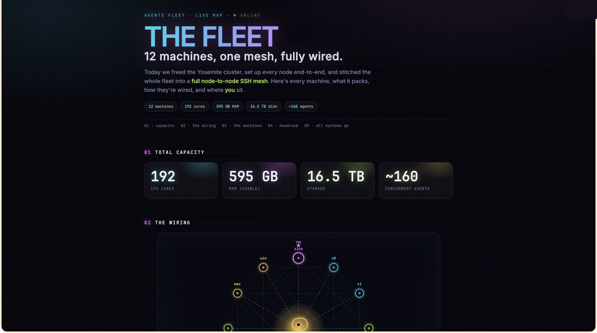
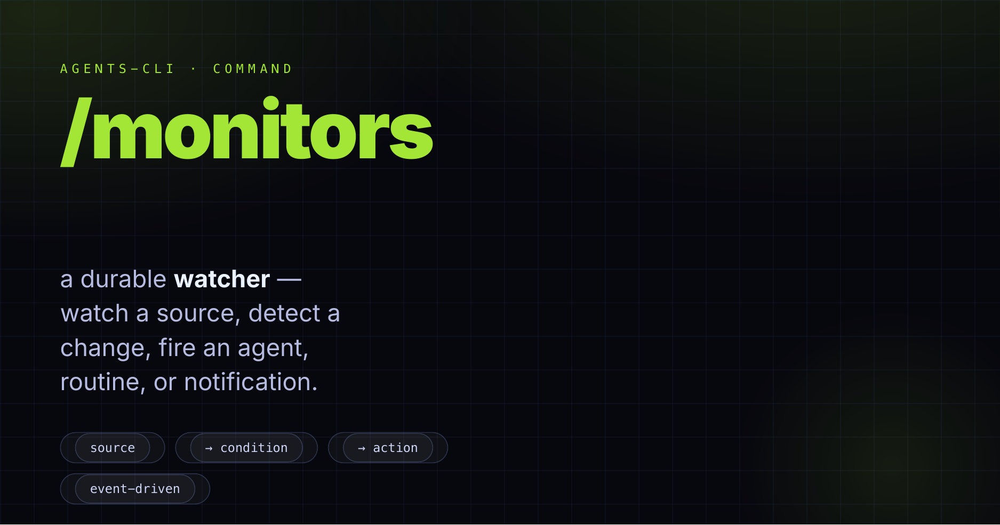
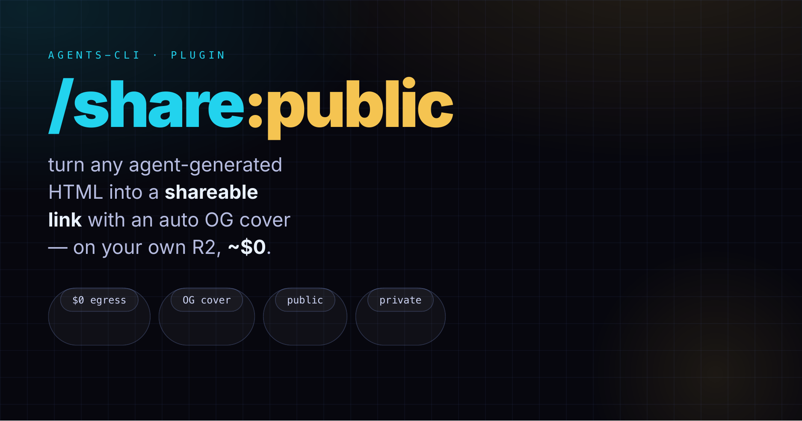

<p align="center">
  
</p>

<h1 align="center">.agents-system</h1>

<p align="center">
  <b>The system layer for <a href="https://www.npmjs.com/package/@phnx-labs/agents-cli">agents-cli</a></b><br>
  npm-shipped defaults — commands, skills, plugins, hooks, rules, and permissions — that every agent inherits.
</p>

<p align="center">
  <a href="https://www.npmjs.com/package/@phnx-labs/agents-cli"></a>
  
  
  
</p>

<p align="center">
  &nbsp;&nbsp;
  &nbsp;&nbsp;
  &nbsp;&nbsp;
  &nbsp;&nbsp;
  
</p>

---

## What this is

This repo is a **DotAgents repo**: a directory of agent config (commands, skills, plugins, hooks, rules, permissions) that `agents-cli` reads. It's the **system layer** — the npm-shipped baseline that ships with the CLI and lands at `~/.agents/.system/` on every machine.

You rarely edit it directly. Instead, `agents-cli` stacks **four repos of the same shape** and merges them, so your personal tweaks live above the shipped defaults:

| Layer | Path on disk | Role | Edited by |
|---|---|---|---|
| **Project** | `<project>/.agents/` | repo-specific overrides, committed with the project | Project maintainers |
| **User** | `~/.agents/` | your personal additions and overrides | **You** |
| **Extras** | `~/.agents-<alias>/` | optional opinionated bundles (opt-in) | Bundle authors |
| **System** | `~/.agents/.system/` *(this repo)* | npm-shipped defaults | Upstream PRs |

Resources resolve **project → user → extras → system**. A same-named resource at a higher layer wins; everything else unions. The merged result is then **materialized** into every installed agent — Claude, Codex, Gemini, Cursor, OpenCode, and more (see [Lifecycle](#lifecycle-get-sync-stay-fresh) below).

> **Want to change something?** Don't edit this repo — add the same-named file under `~/.agents/` (the user layer) and it wins. This repo is a **pull-only mirror** on your machine; local edits here are overwritten on the next update.

## Quick start

```bash
npm install -g @phnx-labs/agents-cli
agents setup          # first-time: clone this repo into ~/.agents/.system/ + install agent CLIs
agents view           # show what's installed across every agent + version
agents doctor         # CLI sign-in + sync status + orphans, at a glance
```

Already installed and just want the repo? `agents setup` is idempotent — re-run it, or `agents repo pull system` to update in place.

## Lifecycle: get, sync, stay fresh

The one thing to understand: **editing a layer does not change your agents.** The layers are the *source*; each agent's home (`~/.claude/`, `~/.codex/`, …) is a *materialized copy*. You edit a layer, then **sync** to rebuild those copies. Sync is a deliberate step — **it does not run on launch**.

```
   ~/.agents/.system/   ┐
   ~/.agents-<alias>/   ├─ merge (project→user→extras→system) ─► agents sync ─► ~/.claude/  ~/.codex/  ~/.gemini/ …
   ~/.agents/           │                                        (materialize)   (per agent + version)
   <project>/.agents/   ┘
```

**Get / update a repo**

| I want to… | Command |
|---|---|
| First-time bootstrap (clone system repo + install CLIs) | `agents setup` |
| Update the shipped defaults (system repo) | `agents repo pull system` |
| Add an opt-in extras bundle | `agents repo add gh:owner/.agents-work` |
| Scaffold my own editable repo | `agents repo init` |
| Update everything (git-pull every repo, then re-materialize) | `agents sync` |

**Sync into your agents (materialize) — always manual**

| I want to… | Command |
|---|---|
| Preview + apply changes into one agent | `agents sync claude` |
| …into a specific version, or all of them | `agents sync claude@2.1.207` · `agents sync claude@all` |
| Re-materialize with no git/network (just rebuild homes) | `agents repo refresh` |
| Heal every gap across every installed version | `agents doctor --fix` |

**Is it out of date? — check the signal**

There's no nagging popup; you ask. `agents doctor` prints a **Sync status** line per installed version:

- **`fresh`** — homes match the merged sources ✅
- **`stale`** — *sources changed since last sync* → run `agents sync` / `agents doctor --fix`
- **`cold`** — that version was never synced

```bash
agents doctor              # human overview: sign-in, fresh/stale/cold, orphans
agents check               # CI drift gate: exits non-zero if anything is stale/cold
agents resources           # which layer each merged resource resolves from
```

Use `agents check` in CI to fail a build when config drifts; use `agents doctor --fix` locally to reconcile it.

## What's tracked

```
.agents/.system/
  commands/        # slash commands (/plan, /debug, /output, /monitors, ...)
  skills/          # capabilities (agents-cli, browser, teams, sessions, ...)
  plugins/         # bundled plugins (cloud, code, fleet, git, share, social, swarm, ...)
  hooks/           # lifecycle scripts + hooks.yaml manifest
  rules/           # AGENTS.md + modular rule fragments
  permissions/     # permission groups + presets
  subagents/       # named sub-agent definitions
  routines/        # scheduled-agent definitions
```

Each directory has its own README ([`commands/`](commands/README.md), [`skills/`](skills/README.md), [`hooks/`](hooks/README.md), [`rules/`](rules/README.md), [`permissions/`](permissions/README.md)). Plugins are registered in [`.claude-plugin/marketplace.json`](.claude-plugin/marketplace.json) and materialized into every installed agent version.

## Commands

Slash commands are prompt templates — [`commands/<name>.md`](commands/) becomes `/<name>`, with `$ARGUMENTS` replaced by what you type. Each row links to its source file.

| Command | Purpose |
|---------|---------|
| **Plan & build** | |
| [`/plan`](commands/plan.md) | Plan with research, code reading, artifacts, optional team review |
| [`/debug`](commands/debug.md) | Root-cause analysis with a full evidence chain |
| [`/clean`](commands/clean.md) | Remove tech debt, consolidate duplicates |
| [`/test`](commands/test.md) | Test critical paths with parallel validation |
| **Ship & review** | |
| [`/commit`](commands/commit.md) | Alias of `/code:commit` — split into max logical commits, push in background |
| [`/review`](commands/review.md) | Alias of `/code:review` — review every PR the session opened, then merge / request-changes per verdict |
| [`/done`](commands/done.md) | Verify work is complete, test, release, file tickets for the remainder |
| [`/finish`](commands/finish.md) | Drive the current task to done end-to-end instead of stopping at a recap or partial handoff |
| [`/prune`](commands/prune.md) | Delete merged branches and worktrees, locally and on origin (conservative) |
| **Recap & resume** | |
| [`/recap`](commands/recap.md) | Summarize state — facts first, hypotheses grounded |
| [`/continue`](commands/continue.md) · [`/recover`](commands/recover.md) · [`/restore`](commands/restore.md) | Resume one session / recover many crashed sessions / restore state |
| [`/hibernate`](commands/hibernate.md) | Sleep this same session until a future time, then wake it (full context) to check on a long wait |
| **Coordinate** | |
| [`/tickets`](commands/tickets.md) | Work with the issue tracker (auto-detects Linear/GitHub/Jira) |
| [`/teams`](commands/teams.md) | Spawn parallel agents for a task |
| **Observe** | |
| [`/monitors`](commands/monitors.md) | Set up a durable event-triggered watcher — watch a source, fire an agent/routine/notification on change |
| [`/output`](commands/output.md) | Fleet-wide token-burn + shipped-output report over a window, rendered as an HTML dashboard + PDF |

See [`commands/README.md`](commands/README.md) for the complete set.

<p align="center">
  
</p>

Several commands escalate to `agents teams` for complex scopes (debug, plan, clean, test, recap, review).

## Skills

Skills are richer than commands — multi-file capabilities with persistent context. The full set ships in [`skills/`](skills/README.md); highlights (each links to its source):

| Skill | Purpose |
|-------|---------|
| [`agents-cli`](skills/agents-cli/) | Manage agent CLIs, versions, config |
| [`browser`](skills/browser/) | Drive browsers for automation |
| [`computer`](skills/computer/) | Drive native macOS apps (screenshot, click, type) |
| [`dither-kit`](skills/dither-kit/) | Default charting library for agent-authored charts and data visualizations |
| [`teams`](skills/teams/) | Organize agents into parallel teams |
| [`run`](skills/run/) / [`routines`](skills/routines/) | Dispatch a single agent / schedule recurring agents |
| [`sessions`](skills/sessions/) | Search and read prior agent transcripts |
| [`secrets`](skills/secrets/) | Keychain-backed env-var bundles |
| [`docs`](skills/docs/) / [`release`](skills/release/) | Write docs / publish packages |
| [`learn`](skills/learn/) | Reflect on a finished session and fold durable lessons back into skills/rules/memory |

See [`skills/README.md`](skills/README.md) for the complete table. Invoke with `/skillname`, or let the agent invoke when relevant.

## Plugins

Plugins bundle related skills, commands, hooks, and subagents into one installable unit. The system layer ships lightweight, no-paid-key plugins by default; heavier or key-gated plugins live in `.agents-extras`.

| Plugin | Purpose |
|--------|---------|
| [`cloud`](plugins/cloud/) | Rush Cloud dispatch — `/cloud:run` runs a prompt on a managed cloud worker that opens a PR; `/cloud:accounts` wires Rush + Claude/Codex credentials |
| [`code`](plugins/code/) | The coding loop — `/code:loop`, `/code:dispatch`, `/code:verify`, `/code:review`, `/code:ship`, `/code:sprint`, `/code:quality`, `/code:learn`, `/commit` |
| [`design`](plugins/design/) | Design workflows — mockups, redesigns, DESIGN.md specs |
| [`fleet`](plugins/fleet/) | Fleet-wide ops across every registered machine — `/fleet:sync` pulls every repo to latest on every device and refreshes all agents (never clobbers local work); `/fleet:onboard` brings a bare device to parity |
| [`git`](plugins/git/) | Pure git plumbing — `/git:prune` prunes merged branches/worktrees with hard data-loss guards; `/git:tag-release` cuts and pushes an annotated release tag |
| [`share`](plugins/share/) | Publish an agent-generated HTML artifact to a shareable link on your own Cloudflare R2 (~$0) — `/share:public` (auto OG cover) / `/share:private` (unlisted, auto-expiring) |
| [`social`](plugins/social/) | Turn a content agent's post archive into strategy — `/social:audit`, `/social:align`, `/social:schedule` |
| [`swarm`](plugins/swarm/) | Fan a task across a team of parallel agents — `/swarm:run`, `/swarm:plan`, `/swarm:spec`, `/swarm:debug`, `/swarm:test`, `/swarm:qa` |

See [`.claude-plugin/marketplace.json`](.claude-plugin/marketplace.json) for the registered set.

<p align="center">
  
</p>

## Rules

[`rules/AGENTS.md`](rules/AGENTS.md) is the canonical instruction file, synced as `CLAUDE.md`, `GEMINI.md`, and `.cursorrules` per agent. Modular fragments in [`rules/subrules/`](rules/subrules/) compose in. See [`rules/README.md`](rules/README.md).

## Hooks

Scripts in [`hooks/`](hooks/README.md) run on agent lifecycle events (`SessionStart`, `UserPromptSubmit`, `Stop`), registered via the `hooks:` block in `agents.yaml`. Key hooks expand `#shortcut` tokens, execute inline `` `!cmd` `` bang commands, and inject context at session start. User overrides go in `~/.agents/agents.yaml` under `hooks:`.

## Customization

Two supported paths — both keep this shipped repo pull-only:

1. **Override individual resources (recommended).** Drop a same-named file under `~/.agents/` — same directory shape as this repo — and the user layer wins. Then materialize it:
   ```bash
   agents sync            # rebuild every agent home from the merged layers
   ```
2. **Add a whole extra bundle.** Register another repo (private/team skills) that merges above system, below your user repo:
   ```bash
   agents repo add gh:your-handle/.agents-work   # clones to ~/.agents-work/
   agents repo list                              # confirm it registered
   agents repo disable work                       # turn off without deleting
   ```

## Going further — extras bundles

This repo is the lean, universal default. Heavier opt-in workflows — parallel coding loops, branded media generation — ship as a separate **extras** bundle:

```bash
agents repo add gh:phnx-labs/.agents-extras   # /loop, /sprint, /dispatch, /verify, /animate, /image, /compose, /design
agents repo list                              # confirm it registered
```

Extras are kept out of system on purpose — they carry heavier dependencies and paid API keys, so the default install stays fast and works on any OS with no setup. Disable anytime with `agents repo disable <alias>`.

## Local-only (gitignored)

Runtime state written here but never committed: `versions/`, `shims/` (installed CLIs); `sessions/`, `teams/`, `swarm/` (execution state); `agents.yaml`, `*.log`, `*.pid` (local config and logs).

## License

MIT
