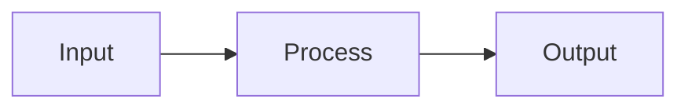

# Write Technical Documentation

For internal architecture docs. High-level, principal engineer style.

## Core Principle

**Document what code can't tell you.** Component boundaries, data flow, system design. Not implementation details.

## Structure

```markdown
# System Name

One paragraph: what this system does, why it exists.

## Architecture

[ASCII/Mermaid structural diagram, or inline SVG for quantitative data]

## Data Flow

[Diagram: how data moves through the system; hand-authored SVG for charts]

## Key Concepts

| Concept | What It Is | Where |
|---------|------------|-------|
| Widget | Does X | `src/widget/` |

## Integration Points

- **Upstream:** What calls this
- **Downstream:** What this calls

## Critical Files

| File | Role |
|------|------|
| `foo.go` | Entry point |
```

## Diagram and Chart Standards

ASCII boxes for architecture:
```
┌─────────────┐     ┌─────────────┐
│  Component  │────▶│  Component  │
└─────────────┘     └─────────────┘
```

Mermaid for flows:


For rendered charts use hand-authored inline SVG or the host document chart API. No mandated chart kit.


## Anti-Patterns

- Explaining how functions work (read the code)
- Duplicating code in docs
- Documenting stable internals
- Prose where a diagram fits

## Reference Style

Point to code, don't copy it:
- `See src/agent/execution.go:306-500`
- `Implementation in src/auth/`

One diagram is worth 1000 words. Write less.
